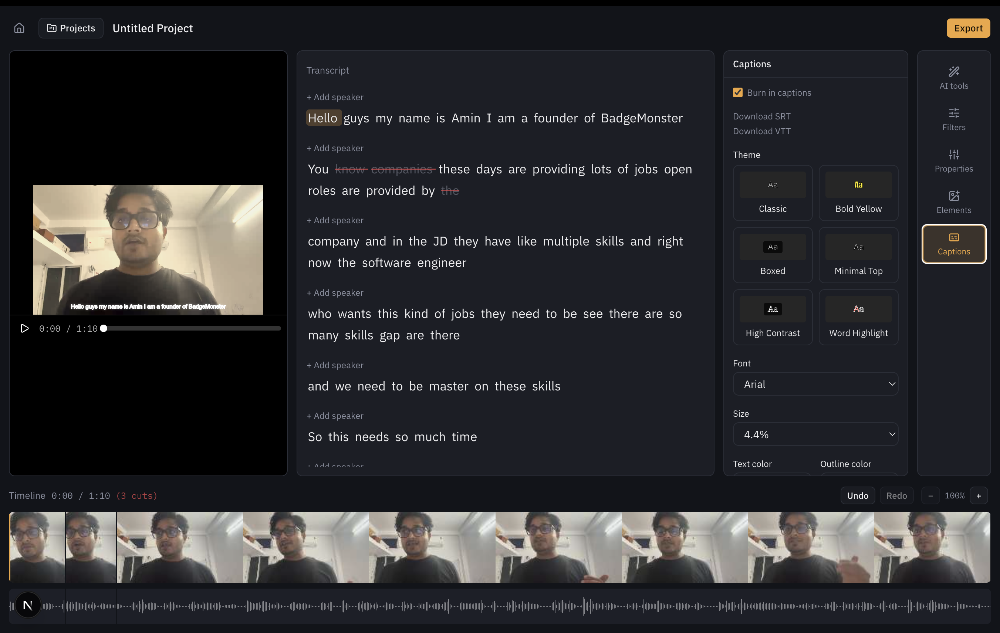

# transcriptcut

[](https://github.com/amide-init/transcriptcut/releases/latest)



Edit video by editing its transcript, with a few explicit AI-assisted
actions (filler-word and long-pause removal) layered on top — **not** a
free-text "ask the AI to edit this" chat bar; an early version of that was
built and worked, then deliberately removed (see Status below and
`claude.md` section 3 for why). **Local-first and open source** — runs
entirely on your machine, no cloud account required. See the
[docs](https://amide-init.github.io/transcriptcut/) for more, and the
[issue tracker](https://github.com/amide-init/transcriptcut/issues) for
current build status.

## Status

The full transcript ↔ video editing loop works end to end: create a
project, upload a video, it's auto-transcribed with word-level
timestamps, delete text in the transcript and the matching section of the
video is cut — reflected on the timeline and skipped during playback,
with undo/redo. The timeline shows zoomable frame thumbnails and a
live-updating waveform (both get denser, not just stretched, as you zoom
in).

Editing tools beyond manual transcript cuts:

- **Filler-word / long-pause detection** — algorithmic, not generative;
  flags candidates for one-click removal. An LLM call only classifies
  ambiguous single words ("like", "actually", ...) in context — it never
  proposes cuts on its own.
- **Filters** — a Descript-style drawer of color presets.
- **Properties** — manual saturation / temperature / tint / exposure /
  contrast / highlights / shadows sliders.
- **Elements** — a logo/watermark overlay (position, padding, opacity).
- **Captions** — font, size, color, position, and background-box styling,
  plus an optional word-by-word karaoke-style highlight.

Export renders the final MP4 with every preview effect above (filters,
properties, logo, captions) baked in — the CSS-preview ↔ ffmpeg-export
math for each is unit-tested (see Testing below) to catch the preview and
the actual export drifting apart, which happened in practice for several
of these (see the issue tracker's closed bugs).

Local persistence (SQLite via Prisma) and project CRUD are built and in
use. The app is a Vite React SPA (`client/`) talking to a Bun/Hono
backend (`server/`) — the two run as separate processes, kept in one
piece by `pnpm run dev` from the repo root. This split (no server-side
rendering, one deployable backend unit) is prep for an eventual native
Mac app via Tauri; see the [issue tracker](https://github.com/amide-init/transcriptcut/issues)
for the full breakdown of what's done vs. planned.

There is no login — v1 is a single local user by design, not a gap to
fill in. **Don't expose this to a public or shared network** without
adding real authentication first; see `claude.md` section 18.

## Structure

```text
claude.md    — product spec
client/      — Vite + React editor UI (SPA, no server rendering)
server/      — Bun + Hono backend (API routes, FFmpeg, Prisma/SQLite, OpenAI)
docs/        — documentation site (VitePress, deployed to GitHub Pages)
```

## Documentation

The full docs site — getting started, architecture, the editing
workflow, screenshots, and how to get involved — is published from
[`docs/`](./docs) via GitHub Pages at
**https://amide-init.github.io/transcriptcut/**.

To run it locally:

```bash
cd docs
pnpm install
pnpm run dev
```

## Running the app

Requires [FFmpeg](https://ffmpeg.org/download.html) and
[Bun](https://bun.sh) (the backend's runtime) on your machine, plus an
OpenAI API key (used server-side only, for transcription).

### macOS quick start

[`scripts/setup-mac.sh`](./scripts/setup-mac.sh) installs Node/pnpm/Bun/
FFmpeg (with subtitle burn-in support) via Homebrew if you don't already
have them, installs dependencies for the whole workspace, and walks you
through `.env`:

```bash
git clone https://github.com/amide-init/transcriptcut.git
cd transcriptcut
./scripts/setup-mac.sh
```

Then `pnpm run dev` from the repo root. Safe to re-run -- it only
installs what's missing and never overwrites an existing `.env`.

### Manual setup (any platform)

```bash
pnpm install                  # installs deps for client + server
cd server
cp .env.example .env          # then fill in OPENAI_API_KEY
bunx prisma generate
cd ..
pnpm run dev                  # runs the Vite client and Bun backend together
```

Open [http://localhost:5173](http://localhost:5173). See
[`server/.env.example`](./server/.env.example) for what each variable
does, and [`CONTRIBUTING.md`](./CONTRIBUTING.md) for more.

## Testing

Deterministic unit tests (Vitest) cover the core editing logic — timeline
cut/trim math, transcript-to-caption mapping, the ffmpeg render-plan
builder, path-traversal safety, and the CSS-preview/ffmpeg-export formula
parity work described in the issue tracker:

```bash
pnpm run test   # runs both client and server test suites
```

CI runs the same command on every PR. There's no end-to-end/UI test suite
yet — see the issue tracker if that's something you'd like to help with.
