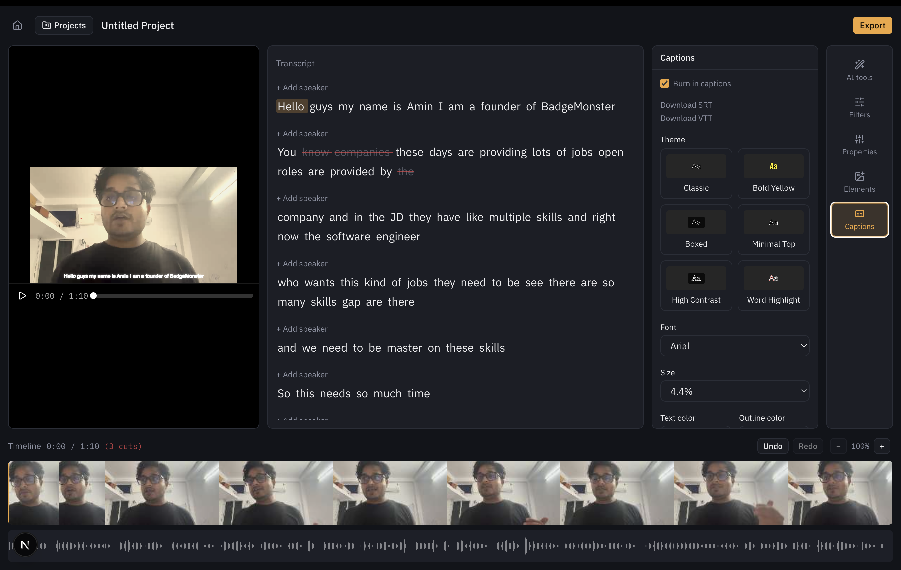

# transcriptcut

[](https://github.com/amide-init/transcriptcut/releases/latest)



Edit video by editing its transcript, built for **video podcasts**:
long multi-speaker episodes in, podcast-ready audio, chapters, show notes,
an MP3 for your feed and vertical Shorts out. AI helps through explicit,
scoped buttons (filler words, speakers, chapters, show notes, highlights),
**not** a free-text "ask the AI to edit this" chat bar; an early version
of that was built and worked, then deliberately removed (see `claude.md`
section 3 for why). **Local-first and open source** — runs entirely on
your machine, no cloud account required. See the
[docs](https://transcriptcut.aamin.me/), especially the
[Podcast Workflow](https://transcriptcut.aamin.me/guide/podcasting)
guide, and the
[issue tracker](https://github.com/amide-init/transcriptcut/issues) for
current build status.

## Status

The full transcript ↔ video editing loop works end to end: create a
project, upload a video, it's auto-transcribed with word-level
timestamps, delete text in the transcript and the matching section of the
video is cut — reflected on the timeline and skipped during playback,
with undo/redo. The timeline shows zoomable frame thumbnails and a
live-updating waveform (both get denser, not just stretched, as you zoom
in).

Editing tools beyond manual transcript cuts:

- **Filler-word / long-pause detection** — algorithmic, not generative;
  flags candidates for one-click removal. An LLM call only classifies
  ambiguous single words ("like", "actually", ...) in context — it never
  proposes cuts on its own.
- **Filters** — a Descript-style drawer of color presets.
- **Properties** — manual saturation / temperature / tint / exposure /
  contrast / highlights / shadows sliders.
- **Elements** — a logo/watermark overlay (position, padding, opacity).
- **Captions** — font, size, color, position, and background-box styling,
  plus an optional word-by-word karaoke-style highlight.

For podcasts:

- **Long episodes** — uploads up to 10 GB; transcription runs in the
  background in ~10-minute chunks split at pauses, with progress; a 720p
  editing proxy keeps big 4K originals smooth in the browser.
- **Speakers** — "Detect speakers" labels who said what; rename a speaker
  everywhere at once, or cut (and restore) everything one person said.
- **Audio** — a one-click podcast preset: -16 / -14 LUFS loudness,
  noise reduction, speaker leveling and a rumble filter, with a
  15-second before/after preview.
- **Publishing** — AI chapters (built into MP4/MP3 exports and copyable as
  YouTube timestamps), editable show notes and title ideas, TXT/Markdown
  transcripts, and MP3/WAV export.
- **Clips / Shorts** — AI picks standalone 15-90s highlights, or clip a
  transcript selection; render 9:16 / 1:1 / 16:9 with a positionable crop
  and big word-by-word captions.

Shaping the episode:

- **Scenes** — split at the playhead (**S**) or before any sentence, then
  name, cut or merge whole scenes. **Suggest scenes** proposes topic
  changes for review, landed on detected camera cuts; or build scenes
  from your chapters.
- **Title cards** — intro, chapter, quote and outro cards between scenes,
  previewed live and rendered into the export.
- **Transitions** — dip to black/white, crossfade into a card, and fades
  in and out of the episode, without shifting anything's timing.
- **B-roll** — upload images and clips, then cover a transcript selection
  full screen or picture-in-picture.

Every edit, including bulk ones like "remove all filler words" or applying
suggested scenes, is a single undo step (**⌘Z** / **⇧⌘Z**).

AI models only ever return text and sentence picks, never timestamps or
edits: times always come from the transcript's own word timestamps, and
every response is validated before use. See the
[AI guide](https://transcriptcut.aamin.me/guide/ai-editing)
for which model does what.

Export renders the final MP4 (or MP3/WAV) with every preview effect above (filters,
properties, logo, captions, audio cleanup) baked in — the CSS-preview ↔ ffmpeg-export
math for each is unit-tested (see Testing below) to catch the preview and
the actual export drifting apart, which happened in practice for several
of these (see the issue tracker's closed bugs).

Local persistence (SQLite via Prisma) and project CRUD are built and in
use. The app is a Vite React SPA (`client/`) talking to a Bun/Hono
backend (`server/`) — the two run as separate processes, kept in one
piece by `pnpm run dev` from the repo root. This split (no server-side
rendering, one deployable backend unit) keeps deployment simple — see the
[issue tracker](https://github.com/amide-init/transcriptcut/issues)
for the full breakdown of what's done vs. planned.

There is no login — v1 is a single local user by design, not a gap to
fill in. **Don't expose this to a public or shared network** without
adding real authentication first; see `claude.md` section 18.

## Structure

```text
claude.md    — product spec
client/      — Vite + React editor UI (SPA, no server rendering)
server/      — Bun + Hono backend (API routes, FFmpeg, Prisma/SQLite, OpenAI)
docs/        — documentation site (VitePress, deployed to GitHub Pages)
```

## Documentation

The full docs site — getting started, architecture, the editing
workflow, screenshots, and how to get involved — is published from
[`docs/`](./docs) via GitHub Pages at
**https://transcriptcut.aamin.me/**.

To run it locally:

```bash
cd docs
pnpm install
pnpm run dev
```

## Running the app

The easiest way to run it is with [Docker](https://docs.docker.com/get-docker/).
The image includes Bun, FFmpeg (with subtitle burn-in support) and the
fonts captions need. You only bring an OpenAI API key, used server-side
for transcription and the AI buttons.

### With Docker

```bash
git clone https://github.com/amide-init/transcriptcut.git
cd transcriptcut
docker compose up --build
```

Open [http://localhost:3001](http://localhost:3001). On first launch the
app asks for your OpenAI API key. To skip that, run `cp .env.example .env`
and set `OPENAI_API_KEY` before starting. It's the same root `.env` the
development setup uses.

Projects, uploads and renders live in the `transcriptcut-data` Docker
volume, so they survive restarts and rebuilds. To update, run
`git pull && docker compose up --build`.

The app is published on `127.0.0.1` only, since it has no login (see
`claude.md` section 18). Caption fonts use free Liberation and DejaVu equivalents of Arial,
Helvetica, Verdana and the rest, so burned-in captions can look slightly
different from the same export on a Mac.

### Development setup

For working on the code, with hot reload. Requires
[FFmpeg](https://ffmpeg.org/download.html) (with `ffprobe`) and
[Bun](https://bun.sh) on your machine:

```bash
git clone https://github.com/amide-init/transcriptcut.git
cd transcriptcut
pnpm install                      # installs deps for client + server
cp .env.example .env              # then fill in OPENAI_API_KEY
pnpm --filter server db:generate  # generates the Prisma client
pnpm run dev                      # runs the Vite client and Bun backend together
```

Open [http://localhost:5173](http://localhost:5173). See
[`.env.example`](./.env.example) for what each variable
does, and [`CONTRIBUTING.md`](./CONTRIBUTING.md) for more.

One thing to know during development:

- **`bun --watch` leaks a few file handles on every reload.** After a long
  session with many server edits, FFmpeg can fail to start with
  `EBADF: bad file descriptor, posix_spawn`. Restart `pnpm run dev` to
  clear it.

## Testing

Deterministic unit tests (Vitest) cover the core editing logic — timeline
cut/trim math, transcript-to-caption mapping, the ffmpeg render-plan
builder (cuts, audio cleanup, reframing, chapter metadata), chunked
transcription and speaker alignment, chapter and highlight validation,
database migrations, path-traversal safety, and the
CSS-preview/ffmpeg-export formula parity work described in the issue
tracker:

```bash
pnpm run test   # runs both client and server test suites
```

CI runs the same command on every PR. There's no end-to-end/UI test suite
yet — see the issue tracker if that's something you'd like to help with.
